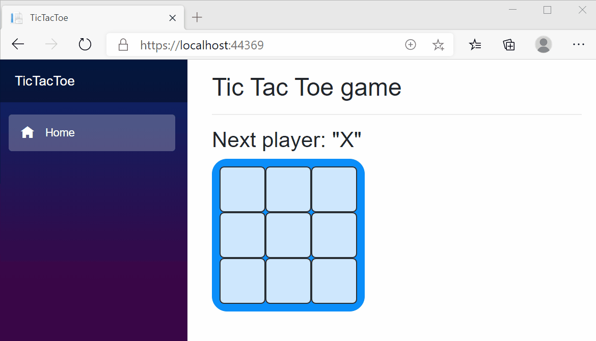

# BlazorTicTacToe


## What is Blazor WebAssembly?
[Blazor WebAssembly](https://docs.microsoft.com/en-us/aspnet/core/blazor/?view=aspnetcore-3.1#:~:text=Blazor%20WebAssembly%20is%20a%20single-page%20app%20%28SPA%29%20framework,in%20all%20modern%20web%20browsers%2C%20including%20mobile%20browsers.) is a [single-page app framework](https://docs.microsoft.com/en-us/dotnet/architecture/modern-web-apps-azure/choose-between-traditional-web-and-single-page-apps) such as Angular, VueJS, and React, that allows one to write UI logic in C#. Running .Net code inside the browser without any plugins or recompiling code into other languages. Blazor WebAssembly includes a proper .NET runtime implemented in WebAssembly, a standardized byte-code for the web. This .NET runtime is downloaded with your Blazor WebAssembly app and enables running normal .NET code directly in the browser.

## Getting Started
A few things are neede to get started on Blazor Web Assembly Project
* Install the [.Net Core 3.1 SDK](https://dotnet.microsoft.com/download/dotnet-core/3.1)
* Install [Visual Studio Code](https://code.visualstudio.com/)
* Install the latest version of the [C# extension in VS Code](https://marketplace.visualstudio.com/items?itemName=ms-dotnettools.csharp)

After installing the above tools, Clone Git repository from GitHub::
```
git clone https://github.com/JuansonGrajales/BlazorTicTacToe.git
```
Switch into the cloned folder:
```
cd BlazorTicTacToe
```
Once you've ran the command above, open the folder and run the following command from VS Code terminal:
```
dotnet run
```
Open the browser and navigate to your local host. You should be able to see the application something like the following :



## Components
Blazor apps are built with [components](https://docs.microsoft.com/en-us/aspnet/core/blazor/components/?view=aspnetcore-3.1#:~:text=Blazor%20apps%20are%20built%20using%20components.%20A%20component,to%20UI%20events.%20Components%20are%20flexible%20and%20lightweight.). A component is a self-contained chunk of user interface, such as a page, dialog, or form. They include HTML markup and the processing logic required to inject data or respond to UI events. 

The root component is called App and can be found in the file App.razor. 
```C#
<Router AppAssembly="@typeof(Program).Assembly">
    <Found Context="routeData">
        <RouteView RouteData="@routeData" DefaultLayout="@typeof(MainLayout)" />
    </Found>
    <NotFound>
        <LayoutView Layout="@typeof(MainLayout)">
            <p>Sorry, there's nothing at this address.</p>
        </LayoutView>
    </NotFound>
</Router>
```
Above are two things to focus on, **Normal routing** and **Not found**. 
* Normal routing is taken care of by the <Found> component. It uses the MainLayout component to set up the DefaultLayout
* Not found is handled by the <NotFound> component and handles any non-defiend routes and outputs an error text
    
The MainLayout renders content using the *@Body*. All site content will be rendered under MainLayout. If you go to the Index.razor file, you'll notice the [*@page "/"*](https://docs.microsoft.com/en-us/dotnet/architecture/blazor-for-web-forms-developers/pages-routing-layouts) at the top of the file. This tells us what route it handles and in this case the *"/"* is our default route. 
    
For this project, you'll find two custom components that make up the TicTacToe game: [Board.razor](https://github.com/JuansonGrajales/BlazorTicTacToe/Components/Board.razor) and [Square.razor](https://github.com/JuansonGrajales/BlazorTicTacToe/Components/Square.razor). The Square component is render with the Board component and the Board Component will be render by the Index.razor page. See below.

```C#

```

