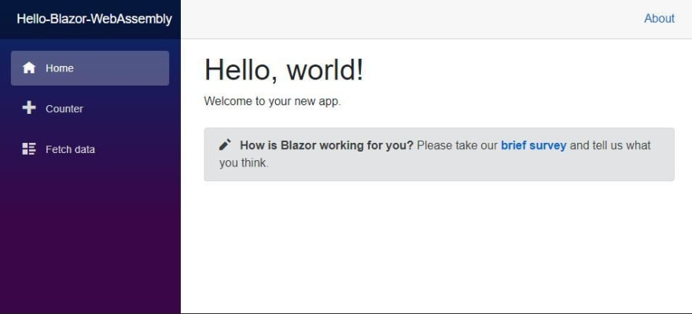

# BlazorTicTacToe


## What is Blazor WebAssembly?
[Blazor WebAssembly](https://docs.microsoft.com/en-us/aspnet/core/blazor/?view=aspnetcore-3.1#:~:text=Blazor%20WebAssembly%20is%20a%20single-page%20app%20%28SPA%29%20framework,in%20all%20modern%20web%20browsers%2C%20including%20mobile%20browsers.) is a [single-page app framework](https://docs.microsoft.com/en-us/dotnet/architecture/modern-web-apps-azure/choose-between-traditional-web-and-single-page-apps) such as Angular, VueJS, and React, that allows one to write UI logic in C#. Running .Net code inside the browser without any plugins or recompiling code into other languages. Blazor WebAssembly includes a proper .NET runtime implemented in WebAssembly, a standardized byte-code for the web. This .NET runtime is downloaded with your Blazor WebAssembly app and enables running normal .NET code directly in the browser.

## Getting Started
A few things are neede to get started on Blazor Web Assembly Project
* Install the [.Net Core 3.1 SDK](https://dotnet.microsoft.com/download/dotnet-core/3.1)
* Install [Visual Studio Code](https://code.visualstudio.com/)
* Install the latest version of the [C# extension in VS Code](https://marketplace.visualstudio.com/items?itemName=ms-dotnettools.csharp)

After installing the above tools, we can create Blazor WebAssembly. Open the command/terminal to run the following command:
```
dotnet new blazorwasm -o <Name of the project>
```
Once you've ran the command above, open the folder and run the following command from VS Code terminal:
```
dotnet run
```
Open the browser and navigate to http://localhost:5000 or https://localhost:5001. You should be able to see the application something like the following :


